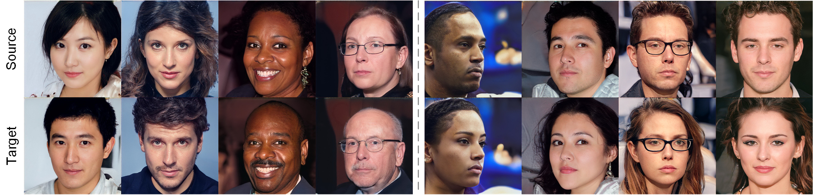
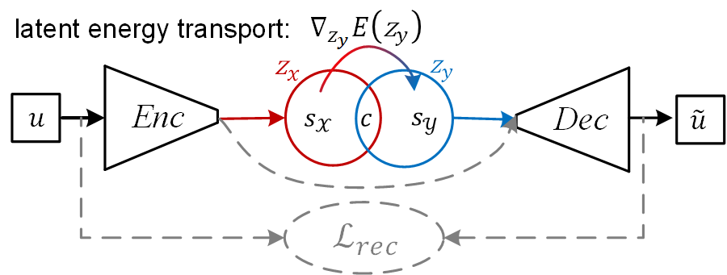
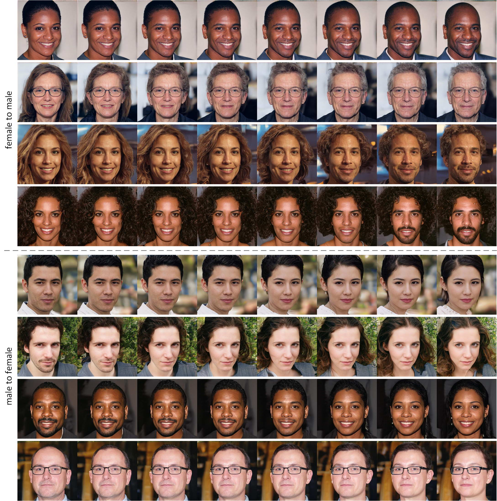

# Unpaired Image-to-Image Translation via Latent Energy Transport

<p align="left"></p>

> **Unpaired Image-to-Image Translation via Latent Energy Transport**<br>
> [Yang Zhao](https://sites.google.com/view/zhao-yang/), [Changyou Chen](https://cse.buffalo.edu/~changyou/)<br>
> 
> Paper: https://arxiv.org/abs/2012.00649<br>
> 
> **Abstract:** *Image-to-image translation aims to preserve source contents while translating to discriminative target styles between two visual domains. Most works apply adversarial learning in the ambient image space, which could be computationally expensive and challenging to train. In this paper, we propose to deploy an energy-based model (EBM) in the latent space of a pretrained autoencoder for this task. The pretrained autoencoder serves as both a latent code extractor and an image reconstruction worker. Our model is based on the assumption that two domains share the same latent space, where latent representation is implicitly decomposed as a content code and a domain-specific style code. Instead of explicitly extracting the two codes and applying adaptive instance normalization to combine them, our latent EBM can implicitly learn to transport the source style code to the target style code while preserving the content code, which is an advantage over existing image translation methods. This simplified solution also brings us far more efficiency in the one-sided unpaired image translation setting. Qualitative and quantitative comparisons demonstrate superior translation quality and faithfulness for content preservation. To the best of our knowledge, our model is the first to be applicable to 1024×1024-resolution unpaired image translation.*


<p align="center"></p>

## Prepare datasets

* AFHQ and CelebA-HQ: please refer to the repo [StarGAN2](https://github.com/clovaai/stargan-v2/) and put them into the folder `datasets`.
* apple2orange and photo2vangoth: please refer to the repo [CycleGAN](https://github.com/junyanz/pytorch-CycleGAN-and-pix2pix) and and put them into the folder `datasets`. Then, please rearange the data following the format of AFHQ or CelebA-HQ.
* celeba: see [here](http://mmlab.ie.cuhk.edu.hk/projects/CelebA.html).
  
Once done, the dataset structure follows:
```
├── datasets
    └── afhq
        ├── train
           ├── cat
           ├── dog
           |── wild
        ├── test
           ├── cat
           ├── dog
           |── wild
    └── celeba
        ├── train
           ├── male
           ├── female
        ├── test
           ├── male
           ├── female
```

## Training

Currently, we provide the implementation based on VQ-VAE-2 and BetaVAE. Please stay tuned for ALAE. (The EBM implementation is almost the same with BetaVAE except for the ALAE backbone.)

We show a translation sequence with ALAE:
<p align="center"></p>

## Citation 

If you find this work useful for your research, please cite our related papers:
```
@article{zhao2020unpaired,
    title={Unpaired Image-to-Image Translation via Latent Energy Transport},
    author={Zhao, Yang and Chen, Changyou},
    journal={arXiv preprint arXiv:2012.00649},
    year={2020}
}

@inproceedings{zhao2021learning,
    title={Learning Energy-Based Generative Models via Coarse-to-Fine Expanding and Sampling},
    author={Yang Zhao and Jianwen Xie and Ping Li},
    booktitle={International Conference on Learning Representations},
    year={2021},
    url={https://openreview.net/forum?id=aD1_5zowqV}
}
```

## Acknowledgements

Our code is inspired by [BetaVAE](https://github.com/1Konny/Beta-VAE), [VQ-VAE-2](https://github.com/rosinality/vq-vae-2-pytorch) and [ALAE](https://github.com/podgorskiy/ALAE).