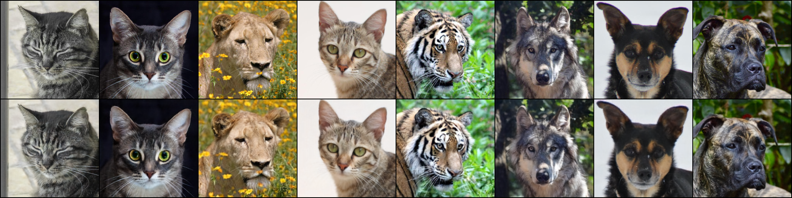
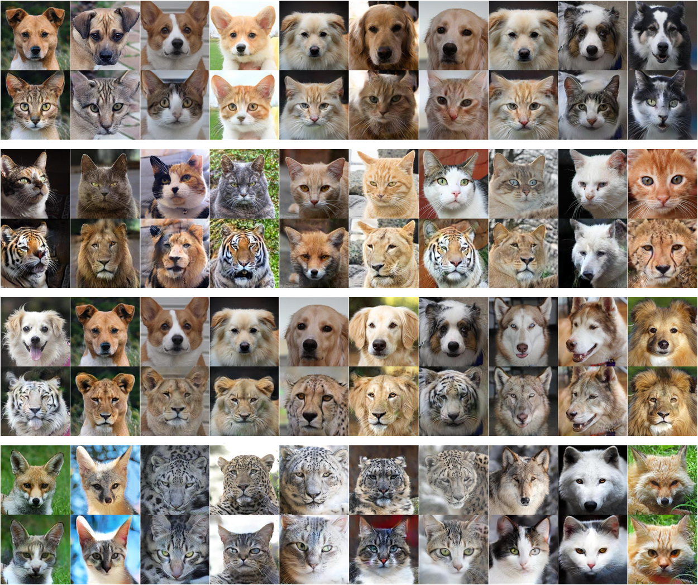

# Implemention of EBM for I2I based on VQ-VAE-2

## Requirements

* Python >= 3.6
* PyTorch >= 1.5 

## Usage 

### Stage 1: Pretrain VQ-VAE-2

Specify `DATASET_NAME` and run the following command, which will excute `train_vqvae.py`.
```
sh run_ae.sh DATASET_NAME
```
We also provide useful customized commands and detailed usage can be found in  `train_vqvae.py`. For example,

* `--embed_dim` the embeding dimension of each level's codebook.(default: 64)
* `--n_embed` the number of codes in the codebook. (default: 512)
* `--n_gpu` number of gpus for parallel training
* `--input_noise` add noise to input image and train vqvae as a denoised ae.(default: 0.0)

Below is the reconsturction result:
<p align="left"></p>

### Stage 2: Train EBM

Specify `DATASET_NAME`, `SRC`, and `TGT`, and run the following command, which will excute `adapt.py`.
```
sh run_ebm.py DATASET_NAME SRC TGT
```
We also provide useful customized commands and detailed usage can be found in  `adapt.py`. For example,

* `--embed_dim` the embeding dimension of each level's codebook.(default: 64)
* `--n_embed` the number of codes in the codebook. (default: 512)
* `--channel_mul` the channel multiplier of EBM
* `--langevin_lr` Langevin step size
* `--langevin_steps` Langevin steps
* `--ae_ckpt` the pretrained VQ-VAE-2 checkpoint to be loaded

Some translation results on AFHQ:
<p align="left"></p>

## Acknowledgements

We adapt the the PyTorch reimplementation of VQ-VAE-2 from the [repo](https://github.com/rosinality/vq-vae-2-pytorch).

## Citation

```
@article{zhao2020unpaired,
  title={Unpaired Image-to-Image Translation via Latent Energy Transport},
  author={Zhao, Yang and Chen, Changyou},
  journal={arXiv preprint arXiv:2012.00649},
  year={2020}
}

@article{razavi2019generating,
  title={Generating diverse high-fidelity images with vq-vae-2},
  author={Razavi, Ali and Oord, Aaron van den and Vinyals, Oriol},
  journal={arXiv preprint arXiv:1906.00446},
  year={2019}
}
```